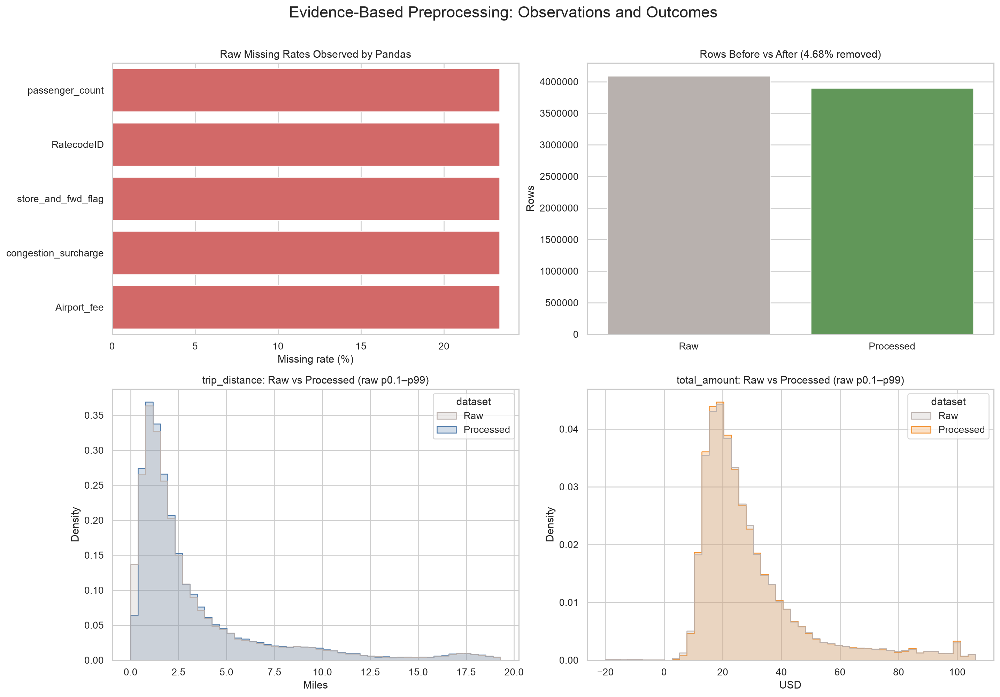
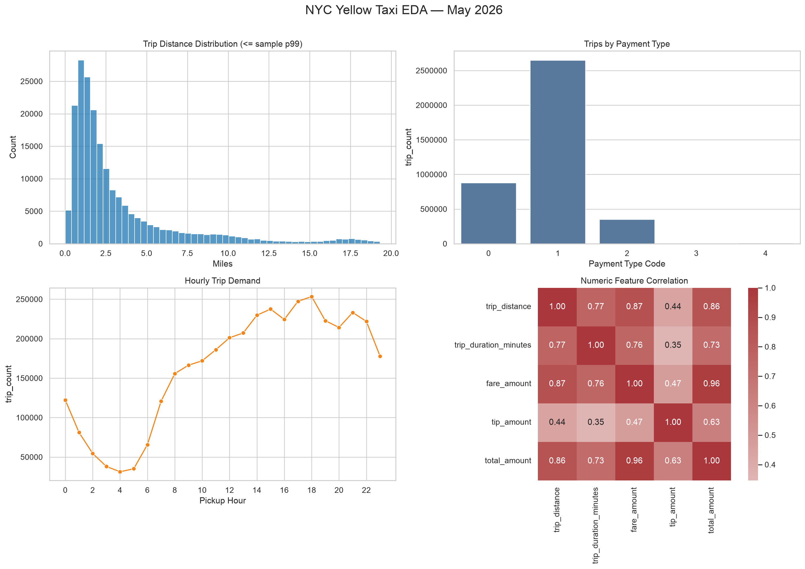

# NYC Yellow Taxi End2End 데이터 분석 프로젝트 보고서

- 대상 데이터: NYC TLC Yellow Taxi Trip Data, 2026년 5월 (전체 4,090,836행)
- 분석 도구: Pandas, Polars, Seaborn, Plotly, SciPy, scikit-learn, Jinja2
- 산출물: 정제 데이터, EDA·통계 산출물, 시각화 3종, 학습 모델, 자동 생성 `reports/report.md`

> 기술통계·품질 위반 건수·전처리 규칙·평가 지표의 **상세 수치표는 파이프라인이 자동 생성하는 `reports/report.md`**에 있다. 이 보고서는 그 수치를 반복하지 않고 **관찰과 판단의 근거**만 정리한다.

---

## 1. 프로젝트 개요

409만 건의 운행 기록에 대해 `데이터 로드 → EDA → 통계 분석 → 전처리 → 시각화 → ML → 보고서 자동 생성` 파이프라인을 구축했다.

핵심 원칙은 **전처리 규칙을 미리 정해두지 않는 것**이다. "이상치는 IQR로 제거" 같은 규칙을 먼저 정하는 대신, **EDA와 통계 검정을 먼저 수행하고 그 관찰값이 규칙을 선택하도록** 만들었다. `DataPreprocessor`는 Pandas 기술통계, Polars EDA 프로파일, 원본 통계 검정 결과를 입력받아 처리 계획을 생성하며, 선택된 규칙과 근거는 `artifacts/preprocessing_decisions.json`에 관찰값·처리·이유 형태로 기록된다.

| 단계 | 클래스 | 역할 |
|---|---|---|
| 1 | `DataLoader` | 원본 다운로드, Pandas/Polars 로딩 비교 |
| 2 | `EDAAnalyzer` | 분포·결측·중복·품질 진단 |
| 3 | `StatisticalAnalyzer` | 원본 통계 검정 (전처리 근거 생성) |
| 4 | `DataPreprocessor` | 근거 기반 정제 + Feature Engineering |
| 5 | `TaxiVisualizer` | Seaborn 정적 차트, Plotly 인터랙티브 차트 |
| 6 | `StatisticalAnalyzer` | 정제 데이터 재검정 (전후 비교) |
| 7 | `ModelTrainer` | sklearn Pipeline 학습·평가·저장 |
| 8 | `ReportGenerator` | `report.md` 자동 생성 |

3단계와 6단계에 같은 클래스가 두 번 등장하는 것은 의도된 설계로, 전처리 전후 동일 검정을 수행해 처리가 결과를 어떻게 바꿨는지 비교하기 위함이다.

### Pandas / Polars 역할 분담

동일한 Parquet를 두 엔진으로 적재해 비교했다. Pandas는 `info()`·`describe()`·`isna()` 등 진단 API가 풍부해 데이터 점검에, Polars Lazy는 409만 행 전량의 분위수·품질 위반 집계에 사용했다.

측정 결과 Polars가 로딩 **3.5×**, GroupBy **4.0×** 빨랐고 메모리는 **1.06×** 적었다. 다만 로딩 배수는 원본 파일(66MB)이 OS 캐시에 올라와 있는지에 따라 크게 흔들리므로, 단일 배수를 근거로 삼기는 어렵다. (*상세: `report.md` §2*)

---

## 2. EDA에서 확인한 문제

원본은 **4,090,836행 × 20열**, **완전 중복 0건**이었다. 전처리가 필요한 문제는 세 갈래다.

**① 분석 월을 벗어난 레코드** — 픽업 시각이 2008-12-31 ~ 2026-06-01에 걸쳐 있어 월 필터가 필요했다.

**② 물리적으로 불가능한 값** — `trip_distance` 최댓값 **307,491마일**(지구 둘레의 12배), 파생 변수 `average_speed_mph` 최댓값 **1,511,821 mph**. 반면 거리 중앙값은 1.87마일, p99는 19.40마일로 **분포 본체는 정상이고 극소수만 오염**된 형태였다.

**③ 음수 금액** — `fare_amount` 최솟값 **-$950**, `total_amount` 최솟값 **-$951**.

한편 `PULocationID`/`DOLocationID` 범위 위반은 **0건**이어서 **Location ID 필터는 활성화되지 않았다.** 규칙이 하드코딩되지 않고 관찰값에 따라 켜지고 꺼진다는 것을 보여주는 사례다. (*품질 위반 14개 항목 전체: `report.md` §3*)

---

## 3. 결측 패턴: Flex Fare 운행

결측이 있는 5개 컬럼(`passenger_count`, `RatecodeID`, `store_and_fwd_flag`, `congestion_surcharge`, `Airport_fee`)의 결측 건수·비율이 **모두 정확히 동일**했다 — 각 **955,371건, 23.3539%**. 교차 확인 결과 `payment_type = 0`인 행이 정확히 같은 건수였고, 두 방향이 모두 성립했다.

- 다섯 컬럼이 모두 결측인 행은 **전부** `payment_type = 0`
- `payment_type = 0`인 행은 **전부** 다섯 컬럼이 결측

**`payment_type = 0`은 TLC 공식 데이터 사전의 `Flex Fare trip`이다** [출처 1]. Flex Fare는 미터 요금이 아니라 **e-hail 배차에서 사전 확정되는 비미터 요금**이다 [출처 2]. 미터 기반으로 산정되는 항목(`congestion_surcharge`, `Airport_fee`)이나 미터 운행에 부수하는 기록(`RatecodeID`, `store_and_fwd_flag`)이 이 요금제와 맞지 않는다는 점이 결측의 정황 설명이 된다.

다만 이는 **정황이지 확인된 인과가 아니다.** 공식 사전은 `payment_type = 0`의 의미를 정의할 뿐 이 5개 필드가 왜 비어 있는지는 설명하지 않는다. 결정적으로, **요금이 부과되지 않아 비어 있는 것인지 부과됐으나 기록되지 않은 것인지를 데이터만으로는 구분할 수 없다.** 확실한 것은 "2026년 5월 자료에서 이 5개 필드가 Flex Fare 전 건에 걸쳐 함께 결측"이라는 관찰뿐이다.

### 대체값을 정한 근거

결측 여부는 `payment_type`만 보면 100% 알 수 있다. 그런데 **`payment_type = 0` 그룹에는 `congestion_surcharge` 관측값이 하나도 없어**, 이 그룹이 원래 얼마였는지를 데이터에서 추정할 방법이 없다. 다른 그룹의 중앙값(2.5)을 가져오는 것도 "Flex Fare에도 미터 할증이 부과됐을 것"이라는 가정을 얹는 셈이라 마찬가지다.

따라서 **`0`은 데이터에서 추정한 값이 아니라 분석을 진행하기 위해 세운 가정이다.** 비미터 요금제라는 점에 근거했지만 공식 문서로 검증된 사실은 아니며, 실제로 할증이 부과됐는데 기록만 누락됐을 가능성은 배제할 수 없다. 금액 가산 여부에 중립적인 값을 택했다는 것이 이 선택의 실질적 근거다.

### Flex Fare 운행은 어떤 운행인가

| | 건수 | 평균 총액 | 거리 중앙값 | 평균 팁 | 팁 발생률 |
|---|---:|---:|---:|---:|---:|
| 그 외 | 3,135,465 | $29.80 | 1.70 mi | $3.74 | 78.4% |
| **Flex Fare** | **955,371** | **$32.74** | **2.63 mi** | $0.48 | 9.3% |

거리가 **54% 길고** 총액이 $2.94 비싸다. 요금제 표기만 다른 것이 아니라 **운행 성격 자체가 다른 집단**이다.

**팁 지표는 주의해서 읽어야 한다.** TLC 데이터 사전은 `tip_amount`가 **신용카드 팁만 기록하며 현금 팁은 포함하지 않는다**고 명시한다 [출처 1]. 팁 발생률 9.3% 대 78.4%는 팁 행동의 차이가 아니라 **상당 부분 기록 방식의 차이**다. 같은 이유로 §5의 카이제곱 결과(`payment_type`–고액 팁, 연관 강도 0.64)도 팁 문화의 차이라기보다 **팁이 기록되는 결제 수단과 그렇지 않은 결제 수단을 구분한 결과**에 가깝다.

이 진단이 실제로 분기시킨 대체값은 `congestion_surcharge` 하나(구조적 미기록이면 `0`, 아니면 중앙값 `2.5`)로, 대체 전략에 미친 영향은 제한적이다. 대신 이 집단이 별개의 운행 유형이라는 점과 팁·카이제곱 해석에 주의가 필요하다는 점을 확인했다.

---

## 4. 이상치가 상관계수를 뒤집었다

전처리 전후 동일 검정을 수행한 결과, 거리–운임 관계에서 큰 차이가 나타났다.

| 검정 | 원본 데이터 | 정제 데이터 |
|---|---:|---:|
| **Pearson** (선형) | **0.0104** | **0.8712** |
| **Spearman** (순위) | 0.7971 | 0.8701 |

원본 Pearson **0.0104**는 "거리와 요금은 사실상 무관하다"는 상식에 반하는 결론을 준다. Pearson은 값의 크기를 직접 사용하므로 `trip_distance = 307,491마일` 같은 극단값 하나가 계산 전체를 지배하기 때문이다. 반면 순위만 쓰는 Spearman은 같은 데이터에서 **0.7971**로 강한 관계를 보였다.

정제 후 Pearson이 **0.8712**로 회복되어 Spearman(0.8701)과 거의 일치했다. 두 계수의 수렴은 극단값이 제거되어 관계가 선형으로 잘 표현된다는 뜻이다. 이 괴리는 코드에서 자동 감지되어 판단 근거로 기록된다.

```
abs(Spearman) - abs(Pearson) >= 0.2  →  이상치에 의한 상관 왜곡으로 판정
```

---

## 5. 전처리 결과와 통계 검정

### 5.1 전처리

관찰값에 따라 활성화된 규칙은 월 필터, 금액·거리·운행시간 상한, 속도·승객 수 제한이다. **IQR 일괄 제거 대신 p99와 최댓값의 격차가 10배를 넘는 경우에만** 도메인 상한을 적용했다. IQR만 쓰면 정상적인 공항·장거리 운행(19마일 이상)까지 제거되기 때문이다.

| 구분 | 값 |
|---|---|
| 전처리 전 | 4,090,836행 × 20열 |
| 전처리 후 | **3,899,516행 × 31열** |
| 제거 | 191,320행 (**4.68%**) |
| 잔여 결측 | **0건** |

**결측 자체를 이유로 행을 삭제하지는 않았다.** 적용 순서는 품질 필터가 먼저이고 결측 대체가 나중이므로, 남은 행의 결측을 대체하는 구조다. 결측이 있던 Flex Fare 원본 955,371건 중 **878,880건(92.0%)**이 최종 데이터에 남았고, 빠진 8.0%는 결측이 아니라 금액·거리·시간 품질 규칙에 걸린 건이다. 열이 20 → 31로 늘어난 것은 운행시간·속도·시간대·주말 여부 등 11개 파생 변수를 생성한 결과다. (*적용 규칙 전체: `report.md` §4*)



### 5.2 통계 검정

원본과 정제 데이터에서 각각 고정 seed(42)로 **200,000건**을 추출해 동일한 검정을 수행했다.

| 검정 | 원본 statistic | 원본 p-value | 정제 statistic | 정제 p-value |
|---|---:|---:|---:|---:|
| Pearson (거리–운임) | 0.0104 | 3.634e-06 | 0.8712 | < 1e-300 |
| Spearman (거리–운임) | 0.7971 | < 1e-300 | 0.8701 | < 1e-300 |
| Welch t-test (주중/주말) | 18.8498 | 3.797e-79 | 17.5577 | 6.254e-69 |
| 카이제곱 (결제유형–고액팁) | 85,226.75 | < 1e-300 | 83,098.67 | < 1e-300 |

**주중/주말 총액 t-test.** 등분산을 가정할 근거가 없어 Welch 검정을 사용했다. 정제 데이터 기준 주중 평균 **$31.06**, 주말 평균 **$29.28**, **t = 17.5577**, **p = 6.254e-69**로 귀무가설을 기각한다.

두 가지에 유의해야 한다.

1. **표본이 20만 건이라 작은 차이도 유의해진다.** 실제 차이는 $1.79로 주중 평균의 약 5.8%다. p-value와 효과 크기를 함께 봐야 한다.
2. **전처리 전후 모두 같은 방향으로 유의**했다. 결론이 전처리 방식에 좌우되지 않았다는 점에서, 전처리로 완전히 뒤집힌 상관계수(§4)와 대조적이다.

다만 **"왜 낮은가"는 t-test가 답해주지 않는다.** 그 원인은 §6에서 분해했다.

### 5.3 시각화



Seaborn 2×2 대시보드는 거리 분포(1~2마일 집중, 오른쪽 꼬리), 결제 유형, 시간대별 수요(새벽 4~5시 최저·오후 6시 최고), 상관관계를 한 화면에 배치했다.

`figures/hourly_demand_interactive.html`(Plotly, 독립 실행형)에서는 주중과 주말의 곡선 모양 차이가 드러난다. 주중은 **오전 7~8시 급증 → 오후 6시 정점(약 17.5만 건)**의 통근 패턴인 반면, 주말은 **새벽 0~2시 수요가 높게 유지되고 오전 급증 구간이 없는** 야간 활동 패턴이다.

---

## 6. 주말 운행은 더 빠르고 마일당 총액이 낮았다

### 6.1 주말 격차의 분해

상식적인 설명은 "주말에는 짧게 타니까"일 것이다. 정제 데이터 전량(3,899,516건)에서 분해했다.

| 항목 | 주중 | 주말 | 차이 |
|---|---:|---:|---:|
| 평균 총액 | $31.13 | $29.29 | **-$1.85** |
| 평균 거리 | 3.49 mi | **3.58 mi** | **+2.6%** |
| 공항 운행 비중 | 7.09% | 6.59% | -0.5%p |
| **마일당 총액(중앙값)** | **$12.56** | **$10.91** | **-13.2%** |
| **평균 속도** | **9.95 mph** | **11.36 mph** | **+14.2%** |
| 평균 팁 비율 | 17.90% | 15.51% | -2.4%p |

**"짧게 타서"는 아니다.** 주말 운행은 오히려 **2.6% 더 길고**, 공항 비중도 거의 같다. 총액과 함께 움직인 것은 거리가 아니라 **마일당 총액(-13.2%)**이며, 같은 방향으로 **평균 속도(+14.2%)**가 관찰된다.

### 6.2 교란 요인 통제

> **지표 정의 —** `마일당 총액 = total_amount ÷ trip_distance`이며, `total_amount`에는 미터 요금뿐 아니라 **팁·통행료·세금·할증이 모두 포함**된다. 순수한 미터 단가가 아니므로 아래 통제에서도 이 점을 감안해야 한다.

**① 거리 구성.** `평균 속도 = 거리 ÷ 시간`, `마일당 총액 = 총액 ÷ 거리`로 두 지표가 거리를 공유하고, 마일당 총액은 거리에 따라 급격히 달라진다(§6.4). 주말이 2.6% 더 길다는 사실만으로 마일당 총액이 낮아 보일 수 있다. 그래서 **거리 구간을 고정해 다시 비교**했다.

| 거리 구간 | 마일당 총액 (주중 → 주말) | 변화 | 평균 속도 (주중 → 주말) |
|---|---|---:|---|
| short (~1.1mi) | $17.15 → $15.17 | **-11.5%** | 7.34 → 8.44 mph |
| medium (~3.1mi) | $10.04 → $9.16 | **-8.8%** | 9.78 → 10.80 mph |
| long (~8.2mi) | $6.42 → $6.08 | **-5.3%** | 16.22 → 18.19 mph |
| very_long (~18.9mi) | $5.18 → $5.11 | -1.4% | 21.19 → 23.82 mph |

**네 구간 모두에서 격차가 유지되고 속도 차이도 함께 나타난다.** 격차는 단거리에서 가장 크고 장거리로 갈수록 줄어드는데(-11.5% → -1.4%), 단거리일수록 전체 소요 시간 중 정체 구간 비중이 커서 시간 요금의 영향을 크게 받는다는 해석과 방향이 맞는다.

**② 요금제 혼입.** 원본의 23.4%를 차지하는 Flex Fare는 요금 산정 방식 자체가 다르다. **표준 미터 요금(`RatecodeID = 1`)만 남겨** 다시 비교해도 주말은 여전히 더 빠르고(9.15 → 10.39 mph, **+13.6%**) 마일당 총액이 낮으며($13.70 → $12.12, **-11.5%**), **거리는 오히려 3.5% 더 길다**(2.56 → 2.65 mi).

**③ 팁 구성.** 위 지표에는 팁이 포함돼 있고 주말 팁 비율이 더 낮으므로(17.90% → 15.51%), 격차의 일부가 팁 차이일 수 있다. `total_amount`에서 팁을 뺀 값으로 다시 계산했다.

| 기준 | 주중 | 주말 | 차이 |
|---|---:|---:|---:|
| 마일당 총액 | $12.56 | $10.91 | -13.2% |
| **팁 제외** | **$11.11** | **$9.79** | **-11.9%** |

**팁이 설명하는 몫은 1.3%p에 그친다.** 나머지 11.9%p는 팁이 아닌 요금 구성에서 나온다.

즉 6.1절의 관찰은 거리 구성으로도, 요금제 혼입으로도, 팁 구성으로도 설명되지 않는다.

### 6.3 요금 체계와의 정합성

NYC 택시 표준 미터 요금은 **거리와 시간을 함께 계산**하므로, 정체가 심할수록 같은 거리에 더 많은 요금이 붙는다 [출처 3]. 같은 관계가 하루 안에서도 관찰된다.

| 시간대 | 평균 속도 | 마일당 총액 |
|---|---:|---:|
| 05시 (가장 한산) | **18.25 mph** | **$7.11** |
| 12시 | 8.93 mph | $12.96 |
| 15시 (가장 정체) | 8.36 mph | $13.10 |
| **17시 (요금 최고)** | 8.53 mph | **$14.14** |
| 23시 | 12.73 mph | $10.13 |

> **정리 —** 주말·시간대 모두에서 속도와 마일당 총액은 뚜렷한 역관계를 보이며, 이는 NYC 요금 구조와 정합적이다.
>
> 다만 **인과 추정은 아니다.** 경로·출발지·도착지·할증 구성·승객 구성을 통제하지 않았고, 두 지표는 계산식상 거리를 공유한다. 시간대 표 역시 동일 조건 운행을 맞댄 것이 아니라 집계 비교이므로, 같은 운행의 요금이 두 배가 된다는 뜻으로 읽어서는 안 된다.

### 6.4 거리 구간별 요금 효율

| 구간 | 건수 | 거리 중앙값 | 총액 중앙값 | 마일당 총액 | 평균 팁 비율 |
|---|---:|---:|---:|---:|---:|
| short (<2mi) | 1,992,429 | 1.11 mi | $17.95 | **$16.53** | **21.3%** |
| medium (2–5mi) | 1,138,644 | 2.88 mi | $28.35 | $9.71 | 13.8% |
| long (5–15mi) | 614,818 | 7.80 mi | $46.85 | $6.30 | 10.4% |
| very_long (≥15mi) | 153,625 | 17.82 mi | $95.44 | **$5.16** | 14.2% |

단거리의 마일당 총액은 장거리의 **3.2배**다. 기본요금이라는 고정비가 짧은 거리에 분산되지 못하기 때문이다. 전체 운행의 **51%가 2마일 미만**이므로 이 구간의 요금 효율이 승객 체감 요금을 좌우한다.

팁 비율은 단순 감소가 아니라 **U자형**(21.3% → 10.4% → 14.2%)이다. 단거리는 반올림 팁, 초장거리는 공항 정액 요금의 영향으로 보이나 추가 검증이 필요하다.

*재현: `.venv/bin/python scripts/domain_analysis.py`*

---

## 7. 머신러닝 Pipeline

### 7.1 설계와 누수 방지

`total_amount`를 목표로 하는 **회귀** 문제로 설정하고, 연속형 금액이므로 **MAE·RMSE·R²**를 사용했다(정확도·F1은 분류 지표로 정의되지 않는다). 전처리와 모델은 하나의 `sklearn.pipeline.Pipeline`(ColumnTransformer + `HistGradientBoostingRegressor`)으로 묶어 저장했다.

**Target Leakage(정답이 입력에 섞이는 것) 방지가 핵심 설계였다.** `total_amount`는 정의상 `fare_amount`, `tip_amount`, 세금·할증의 **합**이므로, 이 컬럼들을 입력에 넣으면 모델은 예측이 아니라 **덧셈을 학습**해 R²가 1에 근접한다. 총액 구성 컬럼 **9개를 전부 제외**했고, 목표 변수에서 계산되는 `cost_per_mile`·`tip_percentage`도 제외했다.

**남아 있는 간접 누수(미수정).** 사후 점검에서 `is_airport_trip`이 누락된 것을 발견했다. 이 변수는 `RatecodeID == 2 또는 Airport_fee > 0`으로 생성되는데 `Airport_fee`는 제외 대상이다. 즉 **직접 제외한 컬럼이 파생 변수를 통해 우회 유입된다.** 기여도는 +$0.30으로 작아 결론을 바꾸지 않지만 설계상 제외했어야 하며, 재학습은 §8의 향후 과제로 남긴다.

최종 입력은 운행 자체의 특성 13개다. 분할은 무작위 대신 **픽업 시각 정렬 후 앞 80% 학습 / 뒤 20% 평가**(150,000행)로, 미래 시점 운행이 학습에 섞이지 않도록 했다. 단, `trip_duration_minutes`·`is_weekend` 등 **Feature Engineering은 Pipeline 밖에서 수행**되므로 새 데이터 예측에는 동일한 전처리를 먼저 거쳐야 한다.

### 7.2 성능

| 지표 | 값 |
|---|---:|
| **MAE** | **$3.238** |
| **RMSE** | **$6.085** |
| **R²** | **0.9157** |
| 중앙값 baseline MAE | $12.864 |
| **baseline 대비 개선** | **74.83%** |

MAE $3.24는 평균 총액 $30.49의 약 10.6% 수준이다. 다만 **R² 0.916이 모델 성능을 뜻하지는 않는다.** 택시 요금은 거리와 시간으로 계산되는 값이고 모델에는 그 두 변수가 모두 들어 있어, 높은 설명력은 문제의 성격에서 온다.

**평균 MAE는 집단별 편차를 감춘다.** 평가 셋을 나눠 보면,

- **결제 유형별**: Flex Fare **$6.49**로 현금 결제(**$1.90**)의 3.4배. 평가 셋의 24%를 차지하는 집단이다. 반대로 팁이라는 변동 요소가 없는 현금 결제에서는 미터 금액을 거의 그대로 재현한다.
- **금액 10분위별**: 최고 분위 MAE **$9.30**(전체 평균의 2.9배)에 **$4.45 과소예측**, 최저 분위는 $2.07 과대예측. 저액은 높게, 고액은 낮게 미는 경향으로, **고액 운행일수록 예측을 신뢰하기 어렵다.**

*재현: `.venv/bin/python scripts/model_diagnostics.py`*

### 7.3 모델은 무엇을 학습했는가

변수 중요도는 **한 변수의 값을 무작위로 섞고 성능이 얼마나 나빠지는지**로 측정했다. 그런데 이 데이터에서는 변수를 하나씩 섞으면 잘못된 답이 나온다. 서로를 그대로 계산해낼 수 있는 변수 쌍이 셋(`is_weekend`←요일, `time_of_day`←시각, `average_speed_mph`←거리÷시간) 있어, 한쪽만 섞어도 모델이 **나머지 짝에서 같은 정보를 복원**하기 때문이다. 실제로 개별 측정에서 세 변수 모두 중요도가 ~0으로 나왔다. 따라서 **중복 변수를 묶어서 함께 섞는 방식**으로 다시 측정했다.

| 변수 그룹 | 제거 시 MAE 증가 |
|---|---:|
| **거리 · 운행시간 · 속도** | **+$14.32** |
| `RatecodeID` | +$2.79 |
| `payment_type` | +$1.11 |
| `is_airport_trip` | +$0.30 |
| 시각 · 시간대 구분 | +$0.23 |
| `VendorID` | +$0.18 |
| **요일 · 주말 여부** | **+$0.17** |
| `passenger_count`, `store_and_fwd_flag` | ~0 |

**거리·시간 그룹이 가장 크다(+$14.32).** 기준 MAE가 $3.24이므로 이 정보를 없애면 오차가 다섯 배 이상으로 뛴다. §6에서 확인한 요금 구조(거리와 시간의 병산)와 방향이 일치한다. 반면 **요일·주말 그룹은 +$0.17**에 그쳐, 거리와 시간을 알고 나면 요일 정보가 더할 것이 거의 없다.

다만 이는 "거리·시간이 주어졌을 때 요일의 추가 예측력이 작다"는 뜻이지, "주말 효과가 거리·시간으로 완전히 설명된다"는 뜻은 아니다.

### 7.4 이 모델을 언제 쓸 수 있는가

§7.1에서 막은 것은 정답이 입력에 섞이는 문제였다. 각 Feature를 **언제 알 수 있는지** 기준으로 다시 보면 다른 문제가 드러난다.

| Feature | 기여도 | 값을 알 수 있는 시점 |
|---|---:|---|
| `trip_distance` | +$7.82 | **하차 후** (실제 주행거리) |
| `trip_duration_minutes` | +$5.97 | **하차 후** (하차−승차 시각) |
| `RatecodeID` | +$2.78 | 정산 시 확정 |
| `payment_type` | +$1.12 | **하차 후** (결제 방식) |
| `pickup_hour` / `pickup_day_of_week` | +$0.17~0.18 | 승차 전 |
| `passenger_count` / `is_weekend` | ~0 | 승차 전 |

**기여도 상위 네 변수가 모두 운행 종료 후에야 확정된다.** 그런데 운행이 끝났다면 미터기가 이미 정확한 금액을 계산해 두었으므로 예측할 대상이 없다. 검증 성능은 좋은데 배포하면 작동하지 않는 전형적인 경우다.

승차 전에 알 수 있는 것은 출발지·목적지·요일·시간대·승객 수뿐인데, **출발지/목적지는 정제 데이터에 있으면서도 현재 모델은 쓰지 않는다.** 지금 구성은 *운행 후에야 아는 정보는 쓰고, 예약 시점에 아는 정보는 쓰지 않는* 상태다.

따라서 이 모델은 **배포 가능한 요금 예측기가 아니라 요금이 무엇으로 결정되는지를 확인한 분석 도구**다. 그 목적에서는 §6의 분석과 방향이 일치하는 결과를 냈지만, 같은 데이터·같은 변수를 쓰므로 독립적 검증은 아니다.

---

## 8. 재현성, 한계, 향후 과제

### 재현성

`ReportGenerator`가 8개 단계 결과를 Jinja2 템플릿에 주입해 `reports/report.md`를 생성한다. 모든 수치가 **실행 결과에서 직접 주입**되며, `StrictUndefined`를 적용해 참조 값이 누락되면 조용히 빈칸이 되지 않고 즉시 오류가 발생한다.

```bash
make setup   # 가상환경 생성 및 의존성 설치
make run     # 전체 파이프라인 실행 (약 19~23초)
make test    # 단위 테스트

.venv/bin/python scripts/domain_analysis.py     # §6 운행 패턴
.venv/bin/python scripts/feature_importance.py  # §7.3 개별 변수 기여도
.venv/bin/python scripts/model_diagnostics.py   # §7.2·7.3 진단
```

재현성 장치는 네 가지다 — **고정 seed(42)**, 단계별 **JSON/CSV 저장**, 정제 규칙과 분기 로직에 대한 **단위 테스트**, 판단 근거를 남기는 **`preprocessing_decisions.json`**. 전체 재실행 결과 통계량·모델 지표가 부동소수점 오차 범위에서 동일하게 재현됐다.

### 한계

- **단일 월 데이터.** 2026년 5월만 분석해 계절성을 확인할 수 없다.
- **§6은 인과 추론이 아니다.** 거리 구간과 요금제를 통제한 뒤에도 관계가 유지된 것은 유리한 근거지만, 경로·지역·할증 구성 등 함께 변하는 요인은 통제하지 않았다.
- **전체 집계에 Flex Fare 혼입.** §6.1·6.3·6.4는 정제 데이터 전체 대상이므로 요금 산정 방식이 다른 Flex Fare(원본의 23.4%)가 포함돼 있다. §6.2에서 이를 제외해도 결론이 유지됨은 확인했다.
- **도메인 상한값의 임의성.** 발동 조건(p99 대비 10배)은 데이터 기반이지만 **상한값 자체**(거리 100마일, 시간 240분, 속도 80mph)는 도메인 지식에서 왔다.
- **모델은 배포 가능한 예측기가 아니다**(§7.4).
- **§5.1의 Flex Fare 잔존율은 스크립트로 재현되지 않는다.** 878,880건(92.0%)은 정제 데이터에서 직접 계산한 값으로, `domain_analysis.py`에 포함돼 있지 않다. 나머지 수치는 모두 파이프라인 또는 `scripts/` 실행으로 재생성된다.

### 향후 과제

우선순위가 가장 높은 것은 **승차 전 정보(`PULocationID`·`DOLocationID`·요일·시간대)만으로 학습하는 요금 예측 모델**이다. 성능은 낮아지겠지만 배차 시점에 실제로 쓸 수 있는 모델이 되고, 두 모델을 비교하면 "어떤 정보를 언제 쓸 수 있는가"가 성능에 요구하는 대가가 정량적으로 보인다. 그 밖에 `is_airport_trip` 제거 후 재학습, 다중 월 계절성·drift 분석, 분위수 회귀를 통한 예측 구간 제공을 고려할 수 있다.

---

## 9. 결론

**주말 운행은 더 빠르고 마일당 총액이 낮았다.** 주말 평균 총액이 $1.85 낮은 것은 통계적으로 유의했고, 원인은 거리가 아니었다 — 주말 운행은 오히려 2.6% 더 길다. 총액과 함께 움직인 것은 마일당 총액(-13.2%)이고 같은 방향으로 평균 속도(+14.2%)가 관찰됐다. 거리 구간을 고정해도, 요금제를 통일해도, 팁을 제외해도 격차는 유지됐다. 거리·시간 병산이라는 NYC 요금 구조와 정합적이지만, 통제하지 않은 요인이 남아 있어 인과로 볼 수는 없다.

**Flex Fare 운행은 별개의 운행 유형이었다.** 다섯 컬럼의 결측이 `payment_type = 0`과 양방향으로 완전히 일치했고, 이 코드는 TLC 공식 사전상 Flex Fare trip이다. 해당 955,371건은 나머지보다 거리가 54% 길고 총액이 비쌌다. `tip_amount`가 카드 팁만 기록하므로, 카이제곱이 잡아낸 강한 연관(0.64)은 팁 문화보다 기록 방식의 차이에 가깝다.

**전처리는 데이터 자체가 결정했다.** 이상치로 왜곡된 Pearson(0.0104)과 순위 상관 Spearman(0.7971)의 괴리를 코드가 자동 감지해 도메인 상한을 활성화했고, 품질 위반이 0건인 Location ID 필터는 활성화되지 않았다. 정제 후 Pearson은 0.8712로 회복됐다.

**모델은 요금 구조를 재현했지만 예측기는 아니다.** 총액 구성 컬럼 9개를 제외하고 시간 순서로 분할해 R² 0.916, MAE $3.24를 얻었으며, 거리·시간 그룹이 성능의 대부분을 설명한다(+$14.32). 다만 기여도 상위 네 변수가 모두 운행 종료 후에야 확정되므로 배차 시점에는 쓸 수 없다.

이 프로젝트를 관통하는 원칙은 **모든 처리 결정에 관찰된 근거를 남기는 것**이었다. 전처리 규칙은 하드코딩되지 않고 데이터가 조건을 평가해 선택되며, 그 과정이 기록되어 제3자가 검증할 수 있다.

---

## 10. 참고 자료

| 번호 | 자료 | 인용 위치 |
|---|---|---|
| 1 | **TLC Yellow Taxi Trip Records Data Dictionary** — `payment_type` 코드 정의(0 = Flex Fare trip), `tip_amount`가 카드 팁만 포함한다는 명시<br>`https://www.nyc.gov/assets/tlc/downloads/pdf/data_dictionary_trip_records_yellow.pdf` | §3 |
| 2 | **TLC E-Hail 사업자 안내 (Flex Fare)** — Flex Fare가 사전 확정 비미터 요금이라는 설명<br>`https://www.nyc.gov/site/tlc/businesses/e-hail-providers.page` | §3 |
| 3 | **TLC Taxi Fare 규정** — 표준 미터 요금의 거리·시간 병산 구조<br>`https://www.nyc.gov/site/tlc/passengers/taxi-fare.page` | §6.3 |
| 4 | **TLC Trip Record Data** — 원본 Parquet 배포처<br>`https://www.nyc.gov/site/tlc/about/tlc-trip-record-data.page` | 전체 |
